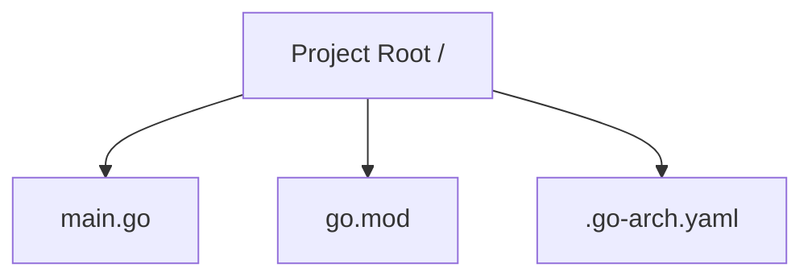
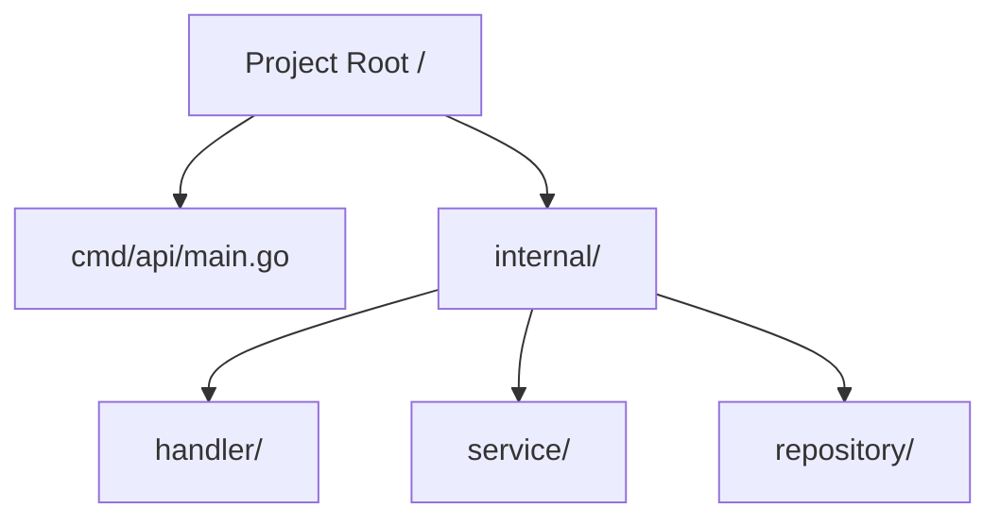
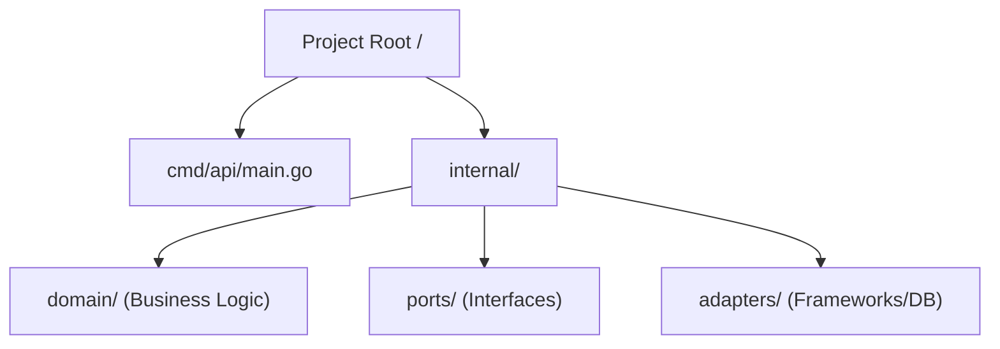

# Project Architecture & Design Patterns 🏗️

This document provides a formal overview of the internal design, directory structures, and architectural principles of **Go-Architect CLI**.

## 📐 Supported Project Layouts

Go-Architect CLI is designed to enforce consistency across different types of Go projects. Depending on the complexity and requirements, users can choose from three distinct layouts:

### 1. Minimalist Layout
Ideal for microservices, lambda functions, or single-source tools.

### 2. Standard Layout
A conventional Go structure for mid-sized applications, following common community practices.

### 3. Hexagonal Layout (Ports & Adapters)
Our premium enterprise-grade layout. It isolates the domain logic from external concerns (DB, API, etc.).

---

## 🛠️ Internal Implementation

The CLI itself follows a modular design to ensure extensibility:

### 1. Component Generation Engine
The `Scaffolder` (located in `internal/pkg/scaffold`) is the brain of the CLI. It uses a **Metadata-Driven** approach:
- **Configuration Persistence**: Every project created with `go-arch new` contains a `.go-arch.yaml` file. This file acts as the project's identity, storing the selected architecture and module name.
- **Dynamic Mapping**: When a user runs `generate`, the CLI reads this YAML file to determine the target directory for the new component.

### 2. Template Engine & Embedding
- **`text/template`**: We use the native Go template engine for its safety and flexibility.
- **`embed` Package**: All blueprints (located in `internal/pkg/template/templates`) are compiled directly into the Go binary. This makes the CLI fully portable—no external template files are required at runtime.

### 3. Evolutionary Scaffolding
Unlike simple "copy-paste" tools, Go-Architect CLI generates code with **Evolutionary Complexity**:
- Interfaces are generated following the **"Accept interfaces, return structs"** Go proverb.
- Initial boilerplate includes manual mocking patterns to support TDD (Test-Driven Development) from Day 1.

---

## 🔒 Security & Best Practices
- **OS Agnostic Paths**: All file operations use `path/filepath` to ensure perfect compatibility between Windows, macOS, and Linux.
- **Viper Integration**: Used for robust configuration management and environment variable overriding.
- **Cobra Framework**: Powers the CLI interface, providing a standard and intuitive user experience.
