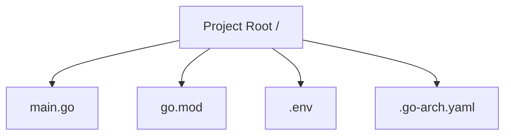
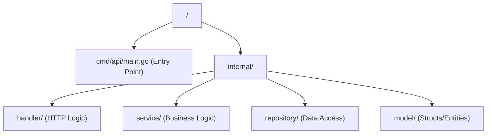
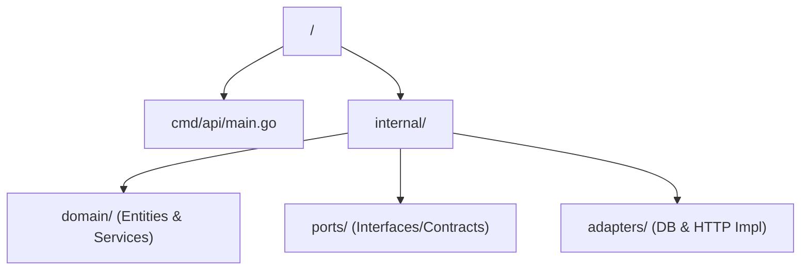

# Project Architecture & Layouts 🏛️

This document provides a deep dive into the architectural principles and folder structures supported by **Go-Architect CLI**. It also explains how the internal "External Templates" engine works.

---

## 📐 Supported Project Layouts

The CLI standardizes projects into three distinct patterns, ranging from minimal logic to enterprise-grade decoupling.

### 1. Minimalist Layout ⚡
Best for microservices, lambda functions, or single-source tools where over-engineering is a risk.
- **Goal**: Speed and simplicity.
- **Structure**:

### 2. Standard Layout 📦
A conventional Go structure following common community practices (Package-oriented design).
- **Goal**: Clarity and separation of concerns for mid-sized apps.
- **Structure**:

### 3. Hexagonal Architecture (Ports & Adapters) ⬢
Our premium enterprise-grade layout. It isolates the domain logic from external concerns.
- **Goal**: High testability and independence from frameworks/databases.
- **Structure**:

---

## 🎨 Deep Customization (External Templates)

One of the most powerful features of `go-arch` is the ability to **override the default code generation** without modifying the CLI binary.

### How the "Lookup" Engine works
When you run a command like `generate crud`, the CLI searches for templates in a hierarchical order of precedence:

1.  **Local Project**: `.go-arch/templates/` inside your project.
2.  **Global User**: `~/.go-arch/templates/` in your Home directory.
3.  **Embedded**: Built-in defaults inside the binary.

### Available Template Helpers
When creating custom templates, you can use these built-in functions to manipulate strings and data:
- `now`: Returns current timestamp.
- `lower`: Converts string to lowercase.
- `upper`: Converts string to uppercase.
- `plural`: **Smart pluralization** (e.g., `Category` -> `Categories`, `User` -> `Users`).

**Usage**: `{{ .EntityName | lower | plural }}`

### Example: Customizing the Handler
If you want all your project handlers to use a specific framework (e.g., Gin instead of net/http), you can create:
`~/.go-arch/templates/common/handler.tmpl`

The CLI will automatically detect it and use your version instead of the default one.

---

## 🛡️ Living Architecture (Validation Rules)
The `go-arch check` command enforces strict dependency rules to prevent architectural decay.

### Hexagonal Rules ⬢
- **Domain (Core)**: MUST NOT import anything from `internal/ports` or `internal/adapters`. The business logic must be pure and independent.
- **Ports (Contracts)**: MUST NOT import `internal/adapters`. Interfaces should not depend on their implementations.

### Standard Rules 📦
- **Model**: Must be self-contained; no imports from other `internal/` packages are allowed.
- **Repository**: MUST NOT import `service` or `handler` to avoid circular dependencies and ensure a one-way data flow.

---

## 🔭 Observability & Telemetry
In 2026, observability is a first-class citizen. `go-arch` implements **OpenTelemetry (OTel)** by default when enabled.

### Implementation Pattern
- **SDK Initialization**: Located in `internal/telemetry/telemetry.go`. It sets up the TracerProvider and Propagators.
- **Agnostic Exporting**: The CLI uses the **OTLP (OpenTelemetry Line Protocol)** over HTTP. This means the Go code is decoupled from the backend; you can switch from Jaeger to SigNoz just by changing the endpoint.
- **Auto-Tracing Middleware**: A pre-configured HTTP middleware (`internal/telemetry/middleware.go`) traces every incoming request, capturing path, method, and duration automatically.

---

## 🐚 Infrastructure & Docker

If **Docker Support** is enabled during the `new` command, the CLI generates:
- **Dockerfile**: Multi-stage build for a minimal production image.
- **docker-compose.yaml**: Orchestration for the app and the selected database.

---

## 🛠️ Internal CLI Architecture

The CLI itself is built following the **Screaming Architecture** pattern:
- **`internal/ui/`**: Cobra & Survey.v2 commands.
- **`internal/pkg/template/`**: The "Lookup" Engine and embedded blueprints.
- **`internal/pkg/scaffold/`**: The orchestrator that maps metadata to file creation.
- **`internal/pkg/osutil/`**: OS-specific detection and utilities.
